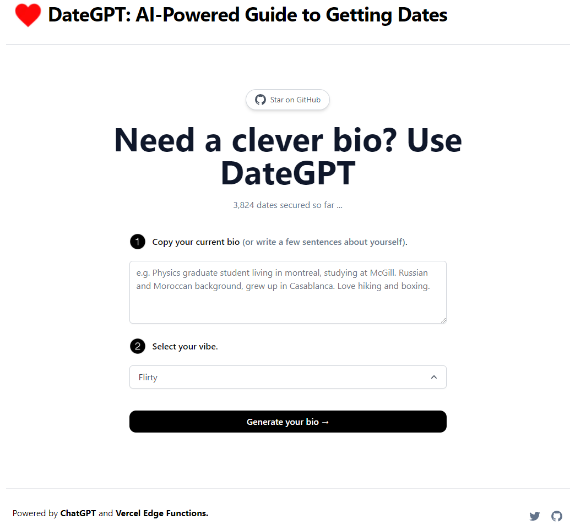

# [DateGPT](https://dategpt.vecel.app/)

This project generates dating app bios for you using AI.

## How it works

This project uses the [ChatGPT API](https://openai.com/api/) and [Vercel Edge functions](https://vercel.com/features/edge-functions) with streaming. It constructs a prompt based on the form and user input, sends it to the chatGPT API via a Vercel Edge function, then streams the response back to the application.

If you'd like to see how I built this, check out this video by @Nutlope [video](https://youtu.be/JcE-1xzQTE0) or [blog post](https://vercel.com/blog/gpt-3-app-next-js-vercel-edge-functions).
